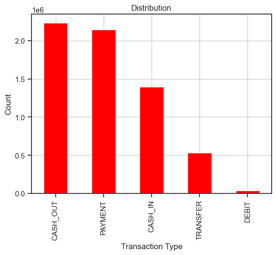

#  Fraud Detection ML App

This repository contains a complete **Fraud Detection Project** that covers:
- Exploratory Data Analysis (EDA)
- Preprocessing of imbalanced datasets
- Training and evaluation of Machine Learning models
- Deployment of a simple **Streamlit web application** for fraud prediction

---

##  Project Overview
Credit card fraud is a critical challenge in financial systems worldwide.  
Using a highly imbalanced dataset of real-world transactions, we tested different models to identify fraudulent activities.

### Objectives
- Perform **EDA** to understand patterns and imbalance.
- Apply **scaling, normalization, and resampling techniques**.
- Build and compare ML models:
  - Logistic Regression
  - Random Forest
  - XGBoost
- Evaluate performance using **ROC-AUC, Precision, Recall, and F1-score**.
- Deploy a lightweight **Streamlit app** for real-time fraud prediction.

---

##  Key Results
- Logistic Regression: High recall but many false positives.
- Random Forest: Best balance, with ~99.97% accuracy and strong F1-score.
- XGBoost: Extremely high recall (0.99), ideal for catching nearly all fraud cases, though with lower precision.

 **Random Forest proved to be the most practical model for production**, minimizing false alarms while still detecting fraud effectively.

---

##  Streamlit Application
A simple web app was built to interact with the trained model.

##  Key Visualizations

  

  

  

  

  

  

  

